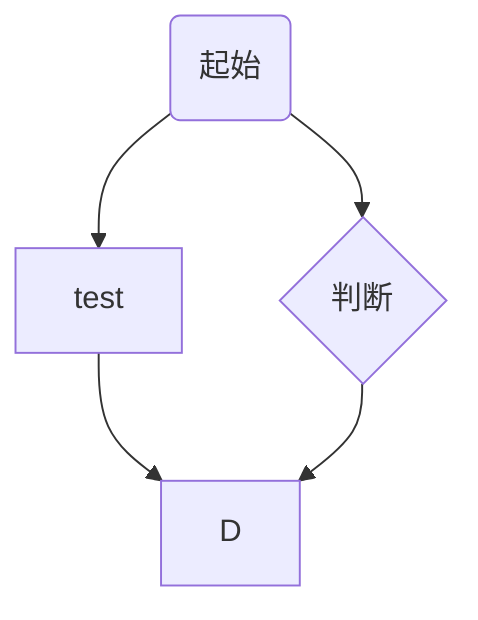

# markdown笔记
## 二级标题两个井号
### 三级
#### 四级
##### 五级
###### 六级

---

**世界** *路* ***成了路***   
__世界__  _路_    ___成了路___  
~~删除线~~  
鲁迅（换行要在最后加空格）  

---
列表和引用  

分段就多空一行就行了
> 引用在前面加大于号
>> 并且可以嵌套

* 列表项 加星号加空格
    * 子项换行加tab
        * 仅支持三级子项
* 列表项
* 列表项

1. 列表项
3. 列表项

5. 列表项

---
数学公式  

数学公式写在$$之间  
$$f(x)=ax_1^2+bx_1+c+\Delta x+\sqrt{2ab}$$
前后各打两个$会居中  

---
代码部分  
三个斜点之后加语言的名称可以高亮语法
```c
int main()
{
    int a=0;

}
```

---
|姓名|年龄|职业|
|:--:|--|--|
|lrq|18岁|电信
|dwx|18岁|电信
|宝宝宝宝|18岁|未知

在表的第二行占位符两侧加英文冒号，可以居中对齐

---
这是百度地址的超链接[超链接](https://wwww.baidu.com)  
这是B站地址的超链接[B站](https://www.bilibili.com)


